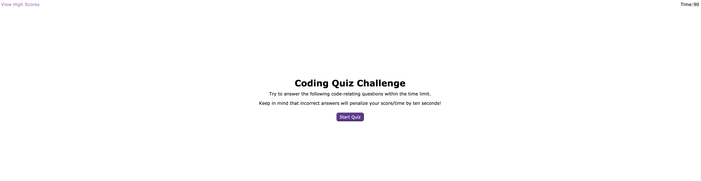
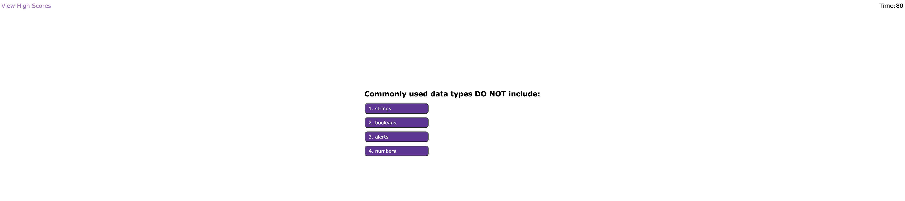

# Quiz

## Purpose
A quiz application that prepares developers for interviews.

## Built With
* HTML
* CSS
* JS

## Website
https://jsun994.github.io/quiz/

## Description
The user takes a timed quiz on JavaScript fundamentals that stores high scores.
The user clicks the start button and the quiz starts with a 90 seconds timer.
The user gains 10 points for every correct answer and loses 5 points for every wrong answer.
The user also loses 10 seconds on the timer for every wrong answer.
The quiz is over if all questions answered or timer reached 0.
When the quiz is over, user can save initals with their score.
The user is then navigated to the high scores page.
The user can reset high scores or go back to re-take the quiz.

